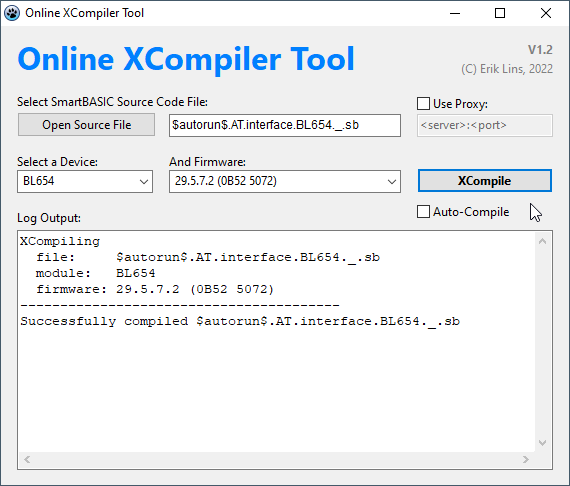
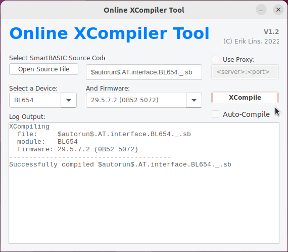

# Online XCompiler Tool
Simple Online XCompiler Tool for the Laird SmartBASIC Online Compiler.

# Simple Frontend for Laird's SmartBASIC Online XCompiler
Laird's online xcompiler lives at http://uwterminalx.no-ip.org/ and offers online compiling of SmartBASIC applications for different SmartBASIC driven Bluetooth modules and SmartBASIC firmware versions, even some which are not supported by the UwTerminalX application. However, it can only compile a single file and does not support #include statements, which are commonly used in SmartBASIC code.

The Online XCompiler Tool supports this and can compile SmartBASIC files \#include'ing other SmartBASIC files. Beside this it's just a bit more convenient to use than the web based xcompiler.

It can run under Windows 32 and 64 bit as well as Linux 32 and 64 bit.

On startup it loads the web page from above URL and grabs devices and firmware versions from the HTML code and populates into the drop down boxes. After selecting a SmartBASIC source code file pressing XCompile button will invoke the online XCompiler and compile. On success it will save the compiled .uwc file to the same location from where the source file was loaded. On error the log output window will show the compiler error message.

## Build Tool
The Online XCompiler Tool was written with [Lazarus](https://www.lazarus-ide.org/index.php) / [Free Pascal](https://www.freepascal.org/). The full project and source code are available in the src folder.

## Releases
Pre-built binaries for Windows 32/64 bit and Linux 32/64 bit are available on the [releases tab](https://github.com/eriklins/online-xcompiler-tool/releases). These do not require any particular installation, just download and run.

## License
Copyright (C) 2022 Erik Lins

This project is released under the MIT License.
